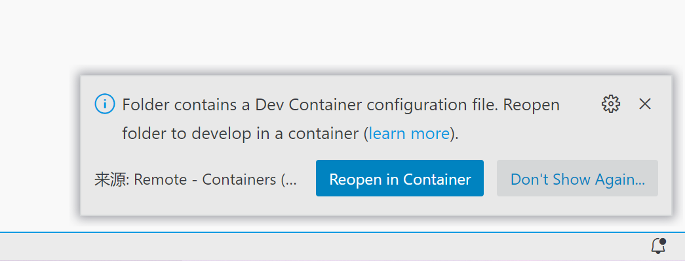

# Flask Dev Container Template

## Get Started

- Clone the project.

```bash
git clone git@github.com:duyixian1234/flask-devcontainer-template.git
```

- Open the project folder with VC Code

```bash
code flask-devcontainer-template
```

- Click the "Reopen in Container" button.



- Wait a while for preparing the dev continer.

- Develop in dev container
